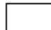
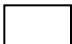

# APPLICATION FOR LICENCE TO CARRY ON

# LABUAN SECURITIES LICENSEE AND CAPITAL MARKET BUSINESS

## IMPORTANT NOTES

1. The completed application form and supporting documents should be submitted to:

Head of Authorisation and Licensing Unit

Labuan Financial Services Authority

Level 17, Main Office Tower

Financial Park Complex

Jalan Merdeka

87000 Labuan F.T.

Malaysia

2. Applicant may also submit a soft copy of the completed application form and supporting documents via email to licensing@labuanfsa.gov.my for preliminary review by the officer.  
3. Submission of application which does not comply with Labuan FSA's requirement or which are unsatisfactory may be returned.  
4. The form and supporting documents serves as general requirement of the application, Labuan FSA reserves the right to request for additional information and/or documents to support the application.  
5. Any information supplied pursuant to this form will be dealt with in confidence in accordance with Section 178 of the Labuan Financial Services and Securities Act 2010/Section 139 of the Labuan Islamic Financial Services and Securities Act 2010.  
6. Documents may be certified by any authorised person including, but not limited to, commissioner for oaths, notary public, certified public accountants, advocates or solicitors, company secretaries and Malaysian/foreign embassies. Copy of bank statements must be certified by the bank. Where documents are not in the national language of Malaysia or in English, please provide English-translated version of the documents, duly certified/notarized.  
7. This document belongs to Labuan FSA, no modification or tampering with the format or its contents is permitted.  
8. Labuan FSA has a whistle blowing policy in place where suppliers, consultants or even members of the public can report to the Designated Officers in writing as per the Whistle Blowing Disclosure Form if there is any element of wrongdoings by any staff of Labuan FSA or its subsidiaries in relation to the application or licence being awarded.  
9. For details of applicable legislations and guidelines pertaining to securities licensee and fund management business, please visit our website at www.labuanfsa.gov.my  
10. Processing fee and client charter:

<table><tr><td rowspan="2">Type of Processing</td><td>Processing Fee</td><td rowspan="2">Client Charter</td></tr><tr><td>USD</td></tr><tr><td>Normal</td><td>350.00</td><td>30 working days</td></tr><tr><td>Fast Track</td><td>1,550.00</td><td>15 working days</td></tr></table>

*Client Charter will be calculated upon complete submission of documentation and information to Labuan FSA.

### Terms and Conditions of fast track application

(i) Labuan FSA reserved the right to accept or decline any fast track application submitted.  
(ii) The fast track processing timeline will only commence upon compliance with the following:

(a) Submission of complete documentation;  
(b) Payment of fast track processing fee; and  
(c) Acceptance of fast track application by Labuan FSA.

(iii) The fast track processing fee will be forfeited should the applicant decided to withdraw after the fast track application has been accepted by Labuan FSA.  
(iv) Labuan FSA reserved the right to change the status of the application from fast track to normal processing. The applicant will be notified and the fast track processing fee paid will be refunded accordingly

## GENERAL INFORMATION

### Important: All fields are mandatory and should not be left blank

1. Party responsible for submission of application1:

Applicant's Shareholder/Head Office

Labuan Trust Company

Others: (please specify)

2. Officer responsible for submission of application:

Name

Company

Designation :

Contact No.:

Email

Signature :

3. How do you know about Labuan IBFC?

Website

Newspaper/Media

Previous Experience

Business Referral

Labuan Trust Company

Labuan IBFC Inc. Sdn. Bhd.2

Others: (please specify)

Consent for disclosure of information to be used for marketing/promotional purposes by Labuan FSA and Labuan IBFC Inc. Sdn. Bhd.:

Yes

No

# APPLICATION FOR LICENCE TO CARRY ON LABUAN SECURITIES LICENSEE AND CAPITAL MARKET BUSINESS

Sections 32, 42, 43 and 56, Labuan Financial Services and Securities Act 2010

Sections 32, 45 and 57, Labuan Islamic Financial Services and Securities Act 2010

<table><tr><td colspan="4">PART I: PROFILE OF APPLICANT
Important: All fields are mandatory and should not be left blank</td></tr><tr><td>a. Name of Applicant
 (refers to the proposed Labuan company)</td><td colspan="3"></td></tr><tr><td>b. Type of Licence Applied
 (Please tick (✓) the appropriate box)</td><td colspan="3">□ Conventional □ Islamic
Please tick (✓) the regulated activities to be undertaken: 
□ Labuan Fund Manager
(please complete Form LSCM and LSCM/1)
□ Labuan Fund Administrator
(please complete Form LSCM and LSCM/2)
□ Labuan Securities Licensee
(please complete Form LSCM and LSCM/2)
□ Labuan Public Fund/ Issuance of Securities Token Offering
(please complete Form LSCM and LSCM/3)</td></tr><tr><td>c. Nature of Legal Entity
 (Please tick (✓) the appropriate box)</td><td colspan="3">□ Labuan Company - Subsidiary
□ Foreign Labuan Company - Branch
□ Other: 
(please specify)</td></tr><tr><td>d. Marketing Office to be Established
 (Please tick (✓) the appropriate box)</td><td colspan="3">□ Yes □ No</td></tr><tr><td>e. Place of Operational Office to be Established in Labuan</td><td colspan="3"></td></tr><tr><td>f. Proposed Paid-up Capital/Working Fund (please specify currency used)</td><td colspan="3"></td></tr><tr><td rowspan="2">Proposed Shareholder(s)
(each of shareholder is required to complete Part II and/or Part III)</td><td>Name of Shareholder(s)</td><td>Country of Origin</td><td>Percentage of Shareholding(s)</td></tr><tr><td></td><td></td><td></td></tr><tr><td rowspan="2">h. Proposed Director(s) (each of Director is required to complete Part IV)</td><td>Name of Director(s)</td><td>Nationality</td><td>Position to be Held</td></tr><tr><td></td><td></td><td colspan="1"></td></tr><tr><td rowspan="2">i. Proposed Shariah Advisor(s) (each of Shariah Advisor is required to complete Part IV)</td><td>Name of Advisor(s)</td><td>Nationality</td><td>Years of Experience in Islamic Financial Business</td></tr><tr><td></td><td></td><td colspan="1"></td></tr><tr><td rowspan="2">l. Credit Rating (if applicable)</td><td>Agency</td><td>Rating</td><td>Date</td></tr><tr><td></td><td></td><td colspan="1"></td></tr><tr><td>m. Any Other Information Relevant For Consideration of the Application</td><td colspan="3"></td></tr></table>

<table><tr><td colspan="5">PART II: PROFILE OF CORPORATE SHAREHOLDER(S)</td></tr><tr><td colspan="5">Important: All fields are mandatory and should not be left blank</td></tr><tr><td>a. Name of Company/Head Office</td><td colspan="4"></td></tr><tr><td>b. Company Address</td><td colspan="4"></td></tr><tr><td>c. Nature and Type of Business</td><td colspan="4"></td></tr><tr><td>d. Incorporation/Registration Number</td><td colspan="4"></td></tr><tr><td>e. Date and Place of Incorporation/Registration</td><td colspan="4"></td></tr><tr><td>f. Date, Type of Licence and Licence Number (if applicable)</td><td colspan="4"></td></tr><tr><td>g. Home Supervisory Authority (if applicable)</td><td colspan="4"></td></tr><tr><td rowspan="4">h. Shareholders' Fund (please specify currency and amount for the latest three(3) years)</td><td>Year</td><td>Paid-up Capital</td><td>Retained Profits/Accumulated Losses</td><td>Other Reserves</td></tr><tr><td></td><td></td><td></td><td></td></tr><tr><td></td><td></td><td></td><td></td></tr><tr><td></td><td></td><td></td><td></td></tr><tr><td rowspan="4">i. Financial Performance (please specify currency and amount for the latest three (3) years)</td><td>Year</td><td>Total Assets</td><td>Total Liabilities</td><td>Profit/(Loss) Before Tax</td></tr><tr><td></td><td></td><td></td><td></td></tr><tr><td></td><td></td><td></td><td></td></tr><tr><td></td><td></td><td></td><td></td></tr><tr><td rowspan="2">j. Shareholder(s)</td><td colspan="2">Name of Shareholder(s)</td><td>Country of Origin</td><td>Percentage of Shareholding(s)</td></tr><tr><td colspan="2"></td><td></td><td></td></tr><tr><td rowspan="2">k. Board of Director(s)</td><td colspan="2">Name of Director(s)</td><td>Nationality</td><td>Nature of Appointment (executive or non-executive)</td></tr><tr><td colspan="2"></td><td></td><td></td></tr><tr><td colspan="5">PART III: PROFILE OF INDIVIDUAL SHAREHOLDER(S)
Important: All fields are mandatory and should not be left blank</td></tr><tr><td>a. Salutation</td><td colspan="4"></td></tr><tr><td>b. Name
(as per NRIC/passport)</td><td colspan="4">Please tick (✓) if the individual is a PEP</td></tr><tr><td>c. Date and Place of Birth</td><td colspan="4"></td></tr><tr><td>d. Gender</td><td colspan="4">Male     Female</td></tr><tr><td>e. Nationality</td><td colspan="4"></td></tr><tr><td>f. NRIC Details
(for Malaysian)</td><td colspan="4">Old IC No.: 
NRIC No.:</td></tr><tr><td>g. Passport Details
(for Non-Malaysian)</td><td colspan="4">Passport No.: 
Expiry Date: 
Country of Issue: 
Issuing Authority: 
Length of residence in Malaysia: 
Any work permit applied prior to this application: 
□No   Yes
(please provide certified true copy of the work permit)</td></tr><tr><td rowspan="7">Financial Net worth
(latest three months bank statement duly certified by the Bank or net worth statement prepared and certified by Qualified Accountant)</td><td colspan="4">a) Net Worth Statement Certified by Qualified Accountant; or</td></tr><tr><td></td><td colspan="3">Currency and Amount</td></tr><tr><td>Total Assets</td><td colspan="3"></td></tr><tr><td>Total Liabilities</td><td colspan="3"></td></tr><tr><td colspan="4">b) Bank Statement/Online Bank Statement Certified by the Bank</td></tr><tr><td>Name of Bank</td><td>Type of Account</td><td>Statement Date</td><td colspan="1">Currency and Amount</td></tr><tr><td></td><td></td><td></td><td colspan="1"></td></tr></table>

<table><tr><td colspan="7">PART III: PROFILE OF INDIVIDUAL SHAREHOLDER(S)Important: All fields are mandatory and should not be left blank</td></tr><tr><td colspan="7">i. Curriculum Vitae of Individual Shareholder</td></tr><tr><td colspan="7">Section A: Tertiary / Highest Education(s)</td></tr><tr><td colspan="2">Type of Qualification/ Certification</td><td colspan="3">Name of School/College/University/Others</td><td colspan="2">YearQualificationObtained</td></tr><tr><td colspan="2"></td><td colspan="3"></td><td colspan="2"></td></tr><tr><td colspan="7">Section B: Professional Qualification(s)</td></tr><tr><td colspan="2">Type of Qualification/Certification</td><td colspan="3">Name of Institution</td><td colspan="2">YearQualificationObtained</td></tr><tr><td colspan="2"></td><td colspan="3"></td><td colspan="2"></td></tr><tr><td colspan="7">Section C: Membership of Professional Body(s)</td></tr><tr><td colspan="2">Type and Details of Membership</td><td colspan="3">Name of Institution</td><td colspan="2">YearMembershipObtained</td></tr><tr><td colspan="2"></td><td colspan="3"></td><td colspan="2"></td></tr><tr><td colspan="7">Section D: Past and Current Work Experience(s)</td></tr><tr><td colspan="2">Date(dd/mm/yy)</td><td rowspan="2">Name of Employer</td><td rowspan="2" colspan="2">Designation</td><td rowspan="2" colspan="2">Key Areas ofResponsibilities</td></tr><tr><td>From</td><td>To</td></tr><tr><td></td><td></td><td></td><td colspan="2"></td><td colspan="2"></td></tr><tr><td colspan="7">Section E: Directorship Held in Other Company(s)</td></tr><tr><td colspan="2">Name of Corporation</td><td>Place of Incorporation</td><td colspan="2">Date ofAppointment(dd/mm/yy)</td><td colspan="2">Nature ofAppointment( executive or non-executive)</td></tr><tr><td colspan="2"></td><td></td><td colspan="2"></td><td colspan="2"></td></tr></table>

<table><tr><td colspan="4">PART IV: PROFILE OF DIRECTOR(S)/SHARIAH ADVISER(S)Important: All fields are mandatory and should not be left blank</td></tr><tr><td>a. Position to be Held</td><td colspan="3"></td></tr><tr><td>b. Salutation</td><td colspan="3"></td></tr><tr><td>c. Name(as per NRIC/passport)</td><td colspan="3">Please tick (✓) if the individual is a PEP</td></tr><tr><td>d. Date and Place of Birth</td><td colspan="3"></td></tr><tr><td>e. Gender</td><td colspan="3">Male Female</td></tr><tr><td>f. Nationality</td><td colspan="3"></td></tr><tr><td>g. NRIC Details(for Malaysian)</td><td colspan="3">Old IC No.:NRIC No.:</td></tr><tr><td>h.Passport Details(for Non-Malaysian)</td><td colspan="3">Passport No.:Expiry Date:Country of Issue:Issuing Authority:Length of residence in Malaysia:Any work permit applied prior to this application:No Yes(please provide certified true copy of the work permit)</td></tr><tr><td colspan="4">i. Curriculum Vitae of Director/Shariah Advisor</td></tr><tr><td colspan="4">Section A: Tertiary / Highest Education(s)</td></tr><tr><td colspan="2">Type of Qualification/ Certification</td><td>Name of College/University/Others</td><td>Year Qualification Obtained</td></tr><tr><td colspan="2"></td><td></td><td></td></tr><tr><td colspan="4">Section B: Professional Qualification(s)</td></tr><tr><td colspan="2">Type of Qualification/ Certification</td><td>Name of Institution</td><td>Year Qualification Obtained</td></tr><tr><td colspan="2"></td><td></td><td></td></tr></table>

<table><tr><td colspan="7">PART IV: PROFILE OF DIRECTOR(S)/SHARIAH ADVISOR(S)Important: All fields are mandatory and should not be left blank</td></tr><tr><td colspan="3"></td><td colspan="3"></td><td></td></tr><tr><td colspan="7">Section C: Membership of Professional Body(s)</td></tr><tr><td colspan="3">Type and Details of Membership</td><td colspan="3">Name of Institution</td><td>YearMembershipObtained</td></tr><tr><td colspan="3"></td><td colspan="3"></td><td></td></tr><tr><td colspan="7">Section D: Past and Current Work Experience(s)</td></tr><tr><td colspan="2">Date(dd/mm/yy)</td><td rowspan="2" colspan="2">Name of Employer3</td><td rowspan="2">Designation</td><td rowspan="2" colspan="2">Key Areas ofResponsibilities</td></tr><tr><td>From</td><td>To</td></tr><tr><td></td><td></td><td colspan="2"></td><td></td><td colspan="2"></td></tr><tr><td colspan="7">Section E: Directorship Held in Other Company(s)</td></tr><tr><td colspan="3">Name of Corporation</td><td colspan="2">Place of Incorporation</td><td>Date of Appointment(dd/mm/yy)</td><td>Nature ofAppointment( executive ornon-executive)</td></tr><tr><td colspan="3"></td><td colspan="2"></td><td></td><td></td></tr></table>

# APPLICATION FOR LICENCE TO CARRY ON BUSINESS AS FUND MANAGER LICENCE

<table><tr><td colspan="6">PART V: PARTICULARS OF THE APPLICATION
Important: All fields are mandatory and should not be left blank</td><td></td></tr><tr><td colspan="6">Section A: Business Plan (Please fill in the details, for additional information please provide copy of business, where applicable)</td><td></td></tr><tr><td>a.</td><td>Objective of Establishment</td><td colspan="4"></td><td></td></tr><tr><td>b.</td><td>Type of Products/Services</td><td colspan="4"></td><td></td></tr><tr><td rowspan="3">c.</td><td rowspan="3">Target Market
(to specify whether it is individual and/or corporate client and the percentage)</td><td>Target Market</td><td>%</td><td rowspan="3" colspan="2"></td><td></td></tr><tr><td>Individual</td><td></td><td></td></tr><tr><td>Corporate Client</td><td></td><td></td></tr><tr><td rowspan="3">d</td><td rowspan="3">Territorial Scope
(to specify the country and percentage)</td><td>Territorial Scope</td><td>%</td><td rowspan="3" colspan="2"></td><td></td></tr><tr><td></td><td></td><td></td></tr><tr><td></td><td></td><td></td></tr><tr><td>e.</td><td colspan="5">Business Operational and Strategic Plan / Structure of Fund Management Services
(included but not limited to the following) - best to be presented in schematic diagram</td><td></td></tr><tr><td>f.</td><td>Type of fund management</td><td colspan="4"></td><td></td></tr><tr><td>g.</td><td>Investment advise</td><td colspan="4"></td><td></td></tr><tr><td>h.</td><td>Management service</td><td colspan="4"></td><td></td></tr><tr><td>i.</td><td>Administrative service</td><td colspan="4"></td><td></td></tr><tr><td>j.</td><td>Dealing in securities</td><td colspan="4"></td><td></td></tr><tr><td>k.</td><td>Marketing Strategy</td><td colspan="4"></td><td></td></tr><tr><td rowspan="6">l.</td><td rowspan="6">Manpower Planning</td><td>Category</td><td>Malaysian</td><td>Non-Malaysian</td><td>Total</td><td>Expected Remuneration</td></tr><tr><td>(a) Managerial &amp; Professional</td><td></td><td></td><td></td><td></td></tr><tr><td>(b) Technical &amp; Supervisory</td><td></td><td></td><td></td><td></td></tr><tr><td>(c) Production / Operation Workers - Skilled - Unskilled</td><td></td><td></td><td></td><td></td></tr><tr><td>(d) Clerical &amp; General Workers</td><td></td><td></td><td></td><td></td></tr><tr><td>Total (a)+(b)+(c)+(d)</td><td></td><td></td><td></td><td></td></tr><tr><td>m.</td><td>Functional Structure of Management Office in Labuan</td><td colspan="5"></td></tr><tr><td>n.</td><td>Functional Structure of MarketingOffice (if any)</td><td colspan="5"></td></tr></table>

<table><tr><td colspan="4">Section B: Three Years Financial Projection (*fill in where applicable)</td></tr><tr><td colspan="4">Currency:</td></tr><tr><td>Statement of Comprehensive Income</td><td>Year 1</td><td>Year 2</td><td>Year 3</td></tr><tr><td>Asset Under Management (AUM)</td><td></td><td></td><td></td></tr><tr><td>Revenue</td><td></td><td></td><td></td></tr><tr><td>- Management services</td><td></td><td></td><td></td></tr><tr><td>- Investment advices</td><td></td><td></td><td></td></tr><tr><td>- Administrative services</td><td></td><td></td><td></td></tr><tr><td>- Dealing in securities</td><td></td><td></td><td></td></tr><tr><td>Other Income</td><td></td><td></td><td></td></tr><tr><td>Gross Income</td><td></td><td></td><td></td></tr><tr><td>Realised Foreign ExchangeGain/(Loss)</td><td></td><td></td><td></td></tr><tr><td>Unrealised Foreign ExchangeGain/(Loss)</td><td></td><td></td><td></td></tr><tr><td>General and Administrative Expenses</td><td></td><td></td><td></td></tr><tr><td>Income/(Loss) Before Tax</td><td></td><td></td><td></td></tr><tr><td>Tax</td><td></td><td></td><td></td></tr><tr><td>Income/(Loss) After Tax</td><td></td><td></td><td></td></tr><tr><td>Statement of Financial Position</td><td>Year 1</td><td>Year 2</td><td>Year 3</td></tr><tr><td colspan="4">ASSETS</td></tr><tr><td>Non-current assets</td><td></td><td></td><td></td></tr><tr><td>Current assets</td><td></td><td></td><td></td></tr><tr><td>Total Assets</td><td></td><td></td><td></td></tr><tr><td colspan="4">LIABILITIES</td></tr><tr><td>Long term liabilities</td><td></td><td></td><td></td></tr><tr><td>Short term liabilities</td><td></td><td></td><td></td></tr><tr><td>Total Liabilities</td><td></td><td></td><td></td></tr><tr><td colspan="4">SHAREHOLDERS&#x27; FUNDS / HEAD OFFICE ACCOUNT</td></tr><tr><td>Head office account / paid upcapital</td><td></td><td></td><td></td></tr><tr><td>Retained profits / accumulatedlosses</td><td></td><td></td><td></td></tr><tr><td>Other reserves</td><td></td><td></td><td></td></tr><tr><td>Total Shareholders&#x27; Funds/Head Office Account</td><td></td><td></td><td></td></tr><tr><td colspan="4">Note: 
1. Please ensure the three years projection is realistic and reasonable.
2. Please provide basis of assumption in deriving to the projected figure.
3. The above information is a guidance for the applicant to complete the financial projection.</td></tr></table>

APPLICATION FOR LICENCE TO CARRY ON BUSINESS AS SECURITIES LICENSEE/ FUND ADMINISTRATOR  

<table><tr><td colspan="6">PART VI:PARTICULARS OF THE APPLICATION
Important:All fields are mandatory and should not be left blank</td><td></td></tr><tr><td colspan="6">Section A: Business Plan (Please fill in the details,where applicable)</td><td></td></tr><tr><td>a.</td><td>Objective of Establishment</td><td colspan="4"></td><td></td></tr><tr><td>b.</td><td>Type of Products/Services</td><td colspan="4"></td><td></td></tr><tr><td rowspan="3">c.</td><td rowspan="3">Target Market (to specify whether it is individual and/or corporate client and the percentage)</td><td colspan="2">Territorial Scope</td><td>%</td><td rowspan="3"></td><td></td></tr><tr><td colspan="2"></td><td></td><td></td></tr><tr><td colspan="2"></td><td></td><td></td></tr><tr><td rowspan="3">d.</td><td rowspan="3">Territorial Scope (to specify the country and percentage)</td><td colspan="2">Territorial Scope</td><td>%</td><td rowspan="3"></td><td></td></tr><tr><td colspan="2"></td><td></td><td></td></tr><tr><td colspan="2"></td><td></td><td></td></tr><tr><td>e.</td><td colspan="5">Business Operational and Strategic Plan (included but not limited to the following) – best presented in schematic diagram</td><td></td></tr><tr><td>•</td><td>Investment services</td><td colspan="4"></td><td></td></tr><tr><td>•</td><td>Dealing in Securities</td><td colspan="4"></td><td></td></tr><tr><td>•</td><td>Administration Services</td><td colspan="4"></td><td></td></tr><tr><td>f.</td><td>Marketing Strategy</td><td colspan="4"></td><td></td></tr><tr><td rowspan="6">g.</td><td rowspan="6">Manpower Planning</td><td>Category</td><td>Malaysian</td><td>Non-Malaysian</td><td>Total</td><td>Expected Remuneration</td></tr><tr><td>(a)Managerial &amp; Professional</td><td></td><td></td><td></td><td></td></tr><tr><td>(b)Technical &amp; Supervisory</td><td></td><td></td><td></td><td></td></tr><tr><td>(d)Production / Operation Workers - Skilled - Unskilled</td><td></td><td></td><td></td><td></td></tr><tr><td>(d) Clerical &amp; General Workers</td><td></td><td></td><td></td><td></td></tr><tr><td>Total (a)+(b)+(c)+(d)</td><td></td><td></td><td></td><td></td></tr></table>

<table><tr><td colspan="2">PART VI:PARTICULARS OF THE APPLICATION
Important:All fields are mandatory and should not be left blank</td></tr><tr><td colspan="2">Section A:Business Plan (Please fill in the details,where applicable)</td></tr><tr><td>h. Functional Structure of
  Management Office in
  Labuan</td><td></td></tr><tr><td>i. Functional Structure of
  MarketingOffice</td><td></td></tr></table>

<table><tr><td colspan="4">Section B: Three Years Financial Projection (*fill in where applicable)</td></tr><tr><td colspan="4">Currency:</td></tr><tr><td>Statement of Comprehensive Income</td><td>Year 1</td><td>Year 2</td><td>Year 3</td></tr><tr><td>Revenue</td><td></td><td></td><td></td></tr><tr><td>- Investment advices</td><td></td><td></td><td></td></tr><tr><td>- Administrative services</td><td></td><td></td><td></td></tr><tr><td>- Dealing in securities</td><td></td><td></td><td></td></tr><tr><td>Other Income</td><td></td><td></td><td></td></tr><tr><td>Gross Income</td><td></td><td></td><td></td></tr><tr><td>Realised Foreign Exchange Gain/(Loss)</td><td></td><td></td><td></td></tr><tr><td>Unrealised Foreign ExchangeGain/(Loss)</td><td></td><td></td><td></td></tr><tr><td>General and Administrative Expenses</td><td></td><td></td><td></td></tr><tr><td>Income/(Loss) Before Tax</td><td></td><td></td><td></td></tr><tr><td>Tax</td><td></td><td></td><td></td></tr><tr><td>Income/(Loss) After Tax</td><td></td><td></td><td></td></tr><tr><td>Statement of Financial Position</td><td>Year 1</td><td>Year 2</td><td>Year 3</td></tr><tr><td colspan="4">ASSETS</td></tr><tr><td>Non-current assets</td><td></td><td></td><td></td></tr><tr><td>Current assets</td><td></td><td></td><td></td></tr><tr><td>Total Assets</td><td></td><td></td><td></td></tr><tr><td colspan="4">LIABILITIES</td></tr><tr><td>Long term liabilities</td><td></td><td></td><td></td></tr><tr><td>Short term liabilities</td><td></td><td></td><td></td></tr><tr><td>Total Liabilities</td><td></td><td></td><td></td></tr><tr><td colspan="4">SHAREHOLDERS&#x27; FUNDS / HEAD OFFICE ACCOUNT</td></tr><tr><td>Head office account / paid upcapital</td><td></td><td></td><td></td></tr><tr><td>Retained profits / accumulatedlosses</td><td></td><td></td><td></td></tr><tr><td>Other reserves</td><td></td><td></td><td></td></tr><tr><td>Total Shareholders&#x27; Funds / HeadOffice Account</td><td></td><td></td><td></td></tr><tr><td colspan="4">Note:</td></tr><tr><td colspan="4">1. Please ensure the three years projection is realistic and reasonable.2. Please provide basis of assumption in deriving to the projected figure.3. The above information is a guidance for the applicant to complete the financial projection.</td></tr></table>

APPLICATION FOR REGISTRATION OF PUBLIC FUND/ISSUANCE OF SECURITIESTOKEN OFFERING  

<table><tr><td colspan="2">PART VII: PARTICULARS OF THE APPLICATION
Important: All fields are mandatory and should not be left blank</td></tr><tr><td colspan="2">Section A: Information on the fund/ Securities Token Offering</td></tr><tr><td>a. Name of Fund/issuer</td><td></td></tr><tr><td>b. Fund Category</td><td></td></tr><tr><td>c. Fund Type
 (To specify whether it is open-ended or close-ended fund)</td><td>Open-EndedClose-
End</td></tr><tr><td>d. Size of Fund</td><td></td></tr><tr><td>e. Term of Fund</td><td></td></tr><tr><td>f. Unit Value</td><td></td></tr><tr><td>g. Minimum Subscription</td><td></td></tr><tr><td>h. Rate of Return</td><td></td></tr><tr><td>i. Launching Date</td><td></td></tr><tr><td>j. Trustee</td><td></td></tr><tr><td>k. Fund Manager</td><td></td></tr><tr><td>l. Fund Administrator</td><td></td></tr><tr><td>m. Custodian</td><td></td></tr><tr><td>n. Promoter/agent
(each promoter is required to complete Section C and/or Section D)</td><td></td></tr><tr><td>o. Place of Business and Address for Service in Labuan</td><td></td></tr><tr><td>p. Place of Business and Address Outside Labuan</td><td></td></tr><tr><td colspan="2">Section B: Business Plan</td></tr><tr><td>a. Target Market/Investor Profile</td><td></td></tr><tr><td>b. Territorial Scope
(by country and percentage)</td><td></td></tr><tr><td>c. Investment Objective</td><td></td></tr></table>

<table><tr><td colspan="6">PART VII: PARTICULARS OF THE APPLICATION
Important: All fields are mandatory and should not be left blank</td></tr><tr><td>d. Investment Policies and Restriction</td><td colspan="5"></td></tr><tr><td>e. Income DistributionPolicies</td><td colspan="5"></td></tr><tr><td colspan="6">Section B: Business Plan</td></tr><tr><td>f. Underwriting Arrangement</td><td colspan="5"></td></tr><tr><td>g. Fees and Charges</td><td colspan="5"></td></tr><tr><td>h. Marketing Strategy</td><td colspan="5"></td></tr><tr><td>i. Marketing Resources or Distribution Channel</td><td colspan="5"></td></tr><tr><td colspan="6">Section C: Information of the Promoter (Corporate Entity)</td></tr><tr><td>a. Name of Company</td><td colspan="5"></td></tr><tr><td>b. Company Address</td><td colspan="5"></td></tr><tr><td>c. Nature and Type of Business</td><td colspan="5"></td></tr><tr><td>d. Incorporation/Registration Number</td><td colspan="5"></td></tr><tr><td>e. Date and Place of Incorporation/Registration</td><td colspan="5"></td></tr><tr><td>f. Date, Type of Licence andLicence Number (if applicable)</td><td colspan="5"></td></tr><tr><td>g. Home Supervisory Authority (if applicable)</td><td colspan="5"></td></tr><tr><td>h. Issued and Paid-up Capital/Working Fund (please specify currency used)</td><td colspan="5"></td></tr><tr><td rowspan="4">Financial Performance (please specify currency and amount for the latest three (3) years)</td><td>Years</td><td>Total asset</td><td>Total Liabilities</td><td>Total Equity</td><td>Profit/loss before Tax</td></tr><tr><td></td><td></td><td></td><td></td><td></td></tr><tr><td></td><td></td><td></td><td></td><td></td></tr><tr><td></td><td></td><td></td><td></td><td></td></tr></table>

<table><tr><td colspan="4">PART VII: PARTICULARS OF THE APPLICATION
Important: All fields are mandatory and should not be left blank</td></tr><tr><td rowspan="2">j. Shareholder(s)</td><td>Name of Shareholder(s)</td><td>Country of Origin</td><td>Percentage of Shareholding(s)</td></tr><tr><td></td><td></td><td></td></tr><tr><td rowspan="2">k Board of Director(s)</td><td>Name of Director(s)</td><td>Nationality</td><td>Nature of Appointment (executive or non-executive)</td></tr><tr><td></td><td></td><td></td></tr><tr><td colspan="4">Section D: Information of the Promoter (Individual)</td></tr><tr><td>a. Salutation</td><td colspan="3"></td></tr><tr><td>b. Name (as per NRIC/passport)</td><td colspan="3">Please tick (✓) if the individual is a PEP</td></tr><tr><td>c. Date and Place of Birth</td><td>Male</td><td colspan="2">Female</td></tr><tr><td>d. Gender</td><td colspan="3"></td></tr><tr><td>e. Nationality</td><td colspan="3"></td></tr><tr><td>f. NRIC Details (for Malaysian)</td><td colspan="3">Old IC No.: 
NRIC No.:</td></tr><tr><td>g. Passport Details (for Non-Malaysian)</td><td colspan="3">Passport No.: 
Expiry Date: 
Country of Issue: 
Issuing Authority:</td></tr><tr><td>h. Curriculum Vitae</td><td colspan="3">Please provide a comprehensive resume of the promoter, which includes:
a) Education background
b) Professional qualification
c) Membership of professional body(s)
d) Past and current work experience</td></tr></table>

PART VII : SUPPORTING DOCUMENTS

(Pleases at the appropriate box and provide reason(s)/justification(s) for any non-submission)

No

Documents

For Applicant

For Labuan FSA

Part II: Corporate Shareholder(s)/Issuer  

<table><tr><td rowspan="7">1.</td><td>Detailed information of applicant's shareholder(s) or head office: 
a) Group corporate shareholding structure including the applicant</td><td></td><td></td></tr><tr><td>b) Certified true copy of certificate of incorporation</td><td></td><td></td></tr><tr><td>c) Certified true copy of certificate of licence granted by relevant authority(s) in its home country - (if applicable)</td><td></td><td></td></tr><tr><td>d) Letter of awareness or approvals of authorities from the home country, if applicable, which includes: 
  (i) Statement of no objection towards the establishment of a subsidiary or branch in Labuan. 
  (ii) Confirmation that the applicant's shareholder or head office is of good financial standing. 
  (iii) Agreement to co-operate in the supervision of the proposed subsidiary or branch in Labuan in terms applicable regulatory standards.</td><td></td><td></td></tr><tr><td>e) Certified true copy of board resolution or minutes of general meeting which approved the setting up of the applicant</td><td></td><td></td></tr><tr><td>f) Certified true copy of memorandum &amp; articles of association</td><td></td><td></td></tr><tr><td>g) Copy of two (2) years audited financial statements/annual reports</td><td></td><td></td></tr><tr><td>2.</td><td>Letter of guarantee or undertaking by: 
  a) applicant's shareholder, if applicant is a subsidiary (format as per AppendixI) 
  b) applicant's head office, if applicant is a branch (format as per Appendix II)</td><td></td><td></td></tr><tr><td colspan="4">Part III: Individual Shareholder(s)</td></tr><tr><td>1.</td><td>Certified true copy of NRIC (Malaysian) or passport (non-Malaysian)</td><td></td><td></td></tr><tr><td>2.</td><td>Certified true copy of relevant academic and professional certificates</td><td></td><td></td></tr><tr><td>3.</td><td>Two (2) referral letters from corporations, institutions and/or professional bodies</td><td></td><td></td></tr><tr><td>4.</td><td>Net worth statement certified by qualified accountant or certified true copy of the latest three months of bank statements indicating the amount of funds available</td><td></td><td></td></tr><tr><td>5.</td><td>Letter of Guarantee by Individual Shareholder as per Appendix III</td><td></td><td></td></tr><tr><td>6.</td><td>Statutory Declaration by Shareholder/Director on Fit and Proper Person as per Appendix IV.</td><td></td><td></td></tr><tr><td>7.</td><td>Enhance Due Diligence report from the trust company / service provider, if applicable.</td><td></td><td></td></tr><tr><td colspan="4">Part IV: Director(s)/Shariah Advisor</td></tr><tr><td>1.</td><td>Certified true copy of NRIC (Malaysian) or passport (non-Malaysian)</td><td></td><td></td></tr><tr><td>2.</td><td>Certified true copy of relevant academic and professional certificates</td><td></td><td></td></tr><tr><td>3.</td><td>Two (2) referral letters from corporation, institutions and/or professional bodies (not applicable for appointment within the group of companies)</td><td></td><td></td></tr><tr><td>4.</td><td>Statutory Declaration by Shareholder/Director on Fit and Proper Person as per Appendix IV.</td><td></td><td></td></tr><tr><td>5.</td><td>Enhance Due Diligence report from the trust company / service provider, if applicable.</td><td></td><td></td></tr><tr><td colspan="4">PART VII: SUPPORTING DOCUMENTS
(Pleases at the appropriate box and provide reason(s)/justification(s) for any non-submission)</td></tr><tr><td colspan="2">No Documents</td><td>For Applicant</td><td>For Labuan FSA</td></tr><tr><td colspan="4">Other Supporting Documents</td></tr><tr><td>1.</td><td>Proposed organisation chart of the applicant</td><td></td><td></td></tr><tr><td>2.</td><td>Declaration of True and Correct Information Submitted as per Appendix V.</td><td></td><td></td></tr><tr><td>3.</td><td>Statutory Declaration by Services Provider Responsible for Submission of Application as per Appendix VI.</td><td></td><td></td></tr><tr><td>4.</td><td>Framework on Know-Your-Customers' policy and compliance to the Anti-Money Laundering, Anti-Terrorism Financing and Proceeds of Unlawful Activities Act 2001</td><td></td><td></td></tr><tr><td>5.</td><td>Risk Management and Internal Control Policy, if any. The policy must be available for inspection once the licence is granted.</td><td></td><td></td></tr><tr><td>6.</td><td>Investment Management Policy, if any. The policy must be available for inspection once the licence is granted.</td><td></td><td></td></tr><tr><td>7.</td><td>Draft services management agreement between the applicant and the service provider for function to be undertaken by other parties.</td><td></td><td></td></tr><tr><td>8.</td><td>Draft of prospectus/White Paper (only applicable to Public fund Securities Token Offering)</td><td></td><td></td></tr><tr><td>9.</td><td>Duly signed Secrecy Declaration by the director(s) (only applicable to public fund)</td><td></td><td></td></tr></table>

Name and Address of Corporate Shareholder

[Date]

The Director General

Labuan Financial Services Authority  
Level 17, Main Office Tower  
Financial Park Labuan, Jalan Merdeka  
87000 Federal Territory of Labuan  
Malaysia

Dear Sir,

## LETTER OF GUARANTEE

The application by [name of applicant], a subsidiary of [name of shareholder] to Labuan FSA dated [date] for a licence to carry on Labuan [type of licence] business under the provisions of theLabuan Financial Services and Securities Act 2010/Labuan Islamic Financial Services and Securities Act 2010 [delete whichever not applicable] (hereinafter referred to as "the Act") refers.

We, being the shareholder, do hereby irrevocably and unconditionally guarantee and undertake in respect of [name of applicant]'s Labuan [type of licence] business, that during validity of [name of applicant]'s license and its operation in Labuan IBFC, it shall comply with the following:

a. The financial obligations and requirements imposed under the Act on it and shall meet its liabilities in respect of its Labuan [type of licence] business.  
b. The requirement to obtain a prior written approval from Labuan FSA for:

i. any change of [name of applicant's shareholder who holds ten per cent or more of its paid-up capital.  
ii. any appointment of [name of applicant]'s director, whom shall be of a fit and proper person.  
iii. any amendment or alteration to any of [name of applicant]'s constituent documents.

c. The requirement to immediately notify Labuan FSA of any amendment or alteration to any information which had been furnished to Labuan FSA in connection with the application for the Labuan [type of licence] business.

We shall when so demanded in writing by Labuan FSA, on first demand, make good, meet and honour the above requirements including, but not limited to, paying such sum of money in satisfaction of such financial obligations, requirements and liabilities to the extent they are properly due in such currency as may be specified by Labuan FSA, and on the basis such payments extinguish such financial obligations, requirements and liabilities of [name of applicant]and the Company.

Yours faithfully,

For and on behalf of [Name of shareholder]