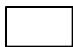
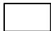
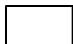

# APPLICATION FOR LICENCE TO CARRY ON LABUAN TRUST COMPANY BUSINESS

## IMPORTANT NOTES

1. The completed application form and supporting documents should be submitted to:

Head of Authorisation and Licensing Unit

Labuan Financial Services Authority Level

17, Main Office Tower

Financial Park Complex

Jalan Merdeka

87000 Labuan F.T.

Malaysia

2. Applicant may also submit a soft copy of the completed application form and supporting documents via email to licensing@labuanfsa.gov.my for preliminary review by the officer.  
3. Submission of application which does not comply with Labuan FSA's requirement or which are unsatisfactory may be returned.  
4. The form and supporting documents serves as general requirement of the application, Labuan FSA reserves the right to request for additional information and/or documents to support the application.  
5. Any information supplied pursuant to this form will be dealt with in confidence in accordance with Section 178 of the Labuan Financial Services and Securities Act 2010/Section 139 of the Labuan Islamic Financial Services and Securities Act 2010.  
6. Documents may be certified by any authorised person including, but not limited to, commissioner for oaths, notary public, certified public accountants, advocates or solicitors, company secretaries and Malaysian/foreign embassies. Copy of bank statements must be certified by the bank. Where documents are not in the national language of Malaysia or in English, please provide English-translated version of the documents, duly certified/notarized.  
7. This document belongs to Labuan FSA, no modification or tampering with the format or its contents is permitted.  
8. Labuan FSA has a whistle blowing policy in place where suppliers, consultants or even members of the public can report to the Designated Officers in writing as per the Whistle Blowing Disclosure Form if there is any element of wrongdoings by any staff of Labuan FSA or its subsidiaries in relation to the application or licence being awarded.  
9. For details of applicable legislations and guidelines pertaining to trust company business, please visit our website at www.labuanfsa.gov.my.  
10. Processing fee and client charter:

<table><tr><td rowspan="2">Type of Processing</td><td>Processing fee</td><td rowspan="2">Client Charter*</td></tr><tr><td>USD</td></tr><tr><td>Normal</td><td>350.00</td><td>30 working days</td></tr><tr><td>Fast Track</td><td>1,550.00</td><td>15 working days</td></tr></table>

*Client Charter will be calculated upon complete submission of documentation and information to Labuan FSA.

## IMPORTANT NOTES

### Terms and Conditions of fast track application

(i) Labuan FSA reserved the right to accept or decline any fast track application submitted.  
(ii) The fast track processing timeline will only commence upon compliance with the following:

(a) Submission of complete documentation;  
(b) Payment of fast track processing fee; and  
(c) Acceptance of fast track application by Labuan FSA.

(iii) The fast track processing fee will be forfeited should the applicant decided to withdraw after the fast track application has been accepted by Labuan FSA.  
(iv) Labuan FSA reserved the right to change the status of the application from fast track to normal processing. The applicant will be notified and the fast track processing fee paid will be refunded accordingly

### GENERAL INFORMATION

#### Important: All fields are mandatory and should not be left blank

1. Party responsible for submission of application1:

Applicant's Shareholder/Head Office

Labuan Trust Company

Others: (please specify)

2. Officer responsible for submission of application:

Name

Company

#

Designa

Contact No.:

__________

Email

Signature

__________

3. How do you know about Labuan IBFC?

Website

Newspaper/Media

Previous Experience

Business Referral

Labuan Trust Company

Labuan IBFC Inc. Sdn. Bhd.2

Others: (please specify)

4. Consent for disclosure of information to be used for marketing/promotional purposes by Labuan FSA and Labuan IBFC Inc. Sdn. Bhd.:

Yes

No

# APPLICATION FOR LICENCE TO CARRY ON LABUAN TRUST COMPANY BUSINESS

Sections 61, 71 and 74, Labuan Financial Services and Securities Act 2010

<table><tr><td colspan="4">PART I: PROFILE OF APPLICANT
Important: All fields are mandatory and should not be left blank</td></tr><tr><td>a. Name of Applicant (refers to the proposed Labuan company)</td><td colspan="3"></td></tr><tr><td>b. Type of Licence Applied (please (√) the appropriate box)</td><td colspan="3">Please tick (√) the regulated activities to be undertaken:
Trust Company (please complete Form LTC and TL)
Managed Trust Company (please complete Form LTC and TL)
Private Trust Company (please complete Form LTC and PTL)</td></tr><tr><td>Nature of Legal Entity (please tick (√) the appropriate box)</td><td colspan="3">Labuan Company - Subsidiary
Foreign Labuan Company - Branch</td></tr><tr><td>d. Proposed Paid-up Capital/Working Fund (please specify currency used)</td><td colspan="3"></td></tr><tr><td rowspan="2">e. Proposed Shareholder(s) (each of shareholder is required to complete Part II and/or Part III)</td><td>Name of Shareholder(s)</td><td>Country of Origin</td><td>Percentage of Shareholding(s)</td></tr><tr><td></td><td></td><td></td></tr><tr><td rowspan="2">f. Proposed Directors and Trust Officers3 (each of director/trust officer is required to complete Part IV)</td><td>Name of Directors/Trust Officers</td><td>Nationality</td><td>Position to be Held</td></tr><tr><td></td><td></td><td></td></tr></table>

<table><tr><td colspan="5">PART II: PROFILE OF CORPORATE SHAREHOLDER(S) 
Important: All fields are mandatory and should not be left blank</td></tr><tr><td>a. Name of Company / Head Office</td><td colspan="4"></td></tr><tr><td>b. Company Address</td><td colspan="4"></td></tr><tr><td>c. Nature and Type of Business</td><td colspan="4"></td></tr><tr><td>d. Incorporation / Registration Number</td><td colspan="4"></td></tr><tr><td>e. Date and Place of Incorporation / Registration</td><td colspan="4"></td></tr><tr><td>f. Date, Type of Licence and Licence Number (if applicable)</td><td colspan="4"></td></tr><tr><td>g. Home Supervisory Authority (if applicable)</td><td colspan="4"></td></tr><tr><td rowspan="4">h. Shareholders' Fund (please specify currency and amount for the latest three (3) years)</td><td>Year</td><td>Paid-up Capital</td><td>Retained Profit / Accumulated Losses</td><td>Other Reserves</td></tr><tr><td></td><td></td><td></td><td></td></tr><tr><td></td><td></td><td></td><td></td></tr><tr><td></td><td></td><td></td><td></td></tr><tr><td rowspan="4">i. Financial Performance (please specify currency and amount for the latest three (3) years)</td><td>Year</td><td>Total Assets</td><td>Total Liabilities</td><td>Profit/(Loss) Before Tax</td></tr><tr><td></td><td></td><td></td><td></td></tr><tr><td></td><td></td><td></td><td></td></tr><tr><td></td><td></td><td></td><td></td></tr><tr><td rowspan="2">j. Shareholder(s)</td><td colspan="2">Name of Shareholder(s)</td><td>Country of Origin</td><td>Percentage of Shareholding(s)</td></tr><tr><td colspan="2"></td><td></td><td></td></tr><tr><td rowspan="2">k. Board of Director(s)</td><td colspan="2">Name of Director(s)</td><td>Nationality</td><td>Nature of Appointment (executive or non-executive)</td></tr><tr><td colspan="2"></td><td></td><td></td></tr><tr><td>l. Any Other Information Relevant For Consideration of the Application</td><td colspan="4"></td></tr><tr><td colspan="5">PART III: PROFILE OF INDIVIDUAL SHAREHOLDER(S) 
Important: All fields are mandatory and should not be left blank</td></tr><tr><td>a. Salutation</td><td colspan="4"></td></tr><tr><td>b. Name 
(as per NRIC/passport)</td><td colspan="4">Please tick (✓) if the individual is a PEP</td></tr><tr><td>c. Date and Place of Birth</td><td colspan="4"></td></tr><tr><td>d. Gender</td><td>Male</td><td colspan="3">Female</td></tr><tr><td>e. Nationality</td><td colspan="4"></td></tr><tr><td>f. NRIC Details 
(for Malaysian)</td><td colspan="4">Old IC No.: 
NRIC No.:</td></tr><tr><td>g. Passport Details 
(for Non-Malaysian)</td><td colspan="4">Passport No.: 
Expiry Date: 
Country of Issue: 
Issuing Authority: 
Length of residence in Malaysia: 
Any work permit applied prior to this application: 
□No □Yes (please provide certified true copy of the work permit)</td></tr><tr><td rowspan="7">Financial Net worth 
(latest three months bank statement duly certified by the Bank or net worth statement prepared and certified by Qualified Accountant)</td><td colspan="4">a) Net Worth Statement by Qualified Accountant; or</td></tr><tr><td></td><td colspan="3">Currency and Amount</td></tr><tr><td>Total Assets</td><td colspan="3"></td></tr><tr><td>Total Liabilities</td><td colspan="3"></td></tr><tr><td colspan="4">b) Bank Statement</td></tr><tr><td>Name of Bank</td><td>Type of Account</td><td>Statement Date</td><td colspan="1">Currency and Amount</td></tr><tr><td></td><td></td><td></td><td colspan="1"></td></tr></table>

<table><tr><td colspan="6">PART III: PROFILE OF INDIVIDUAL SHAREHOLDER(S)Important: All fields are mandatory and should not be left blank</td></tr><tr><td colspan="6">i. Curriculum Vitae of Individual Shareholder</td></tr><tr><td colspan="6">Section A: Education(s)</td></tr><tr><td colspan="3">Type of Qualification/ Certification</td><td colspan="2">Name of College/University/Others</td><td>Year 
Qualification Obtained</td></tr><tr><td colspan="3"></td><td colspan="2"></td><td></td></tr><tr><td colspan="6">Section B: Professional Qualification(s)</td></tr><tr><td colspan="3">Type of Qualification/ Certification</td><td colspan="2">Name of Institution</td><td>Year 
Qualification Obtained</td></tr><tr><td colspan="3"></td><td colspan="2"></td><td></td></tr><tr><td colspan="6">Section C: Membership of Professional Body(s)</td></tr><tr><td colspan="3">Type and Details of Membership</td><td colspan="2">Name of Institution</td><td>Year 
Membership Obtained</td></tr><tr><td colspan="3"></td><td colspan="2"></td><td></td></tr><tr><td colspan="6">Section D: Past and Current Work Experience(s)</td></tr><tr><td colspan="2">Date(dd/mm/yy)</td><td rowspan="2" colspan="2">Name of Employer</td><td rowspan="2">Designation</td><td rowspan="2">Key Areas of Responsibilities</td></tr><tr><td>From</td><td>To</td></tr><tr><td></td><td></td><td colspan="2"></td><td></td><td></td></tr><tr><td colspan="6">Section E: Directorship Held in Other Company(s)</td></tr><tr><td>Name of Corporation</td><td>Place of Incorporation</td><td colspan="2">Date of Appointment(dd/mm/yy)</td><td colspan="2">Nature of Appointmentexecutive or non-executive)</td></tr><tr><td></td><td></td><td colspan="2"></td><td colspan="2"></td></tr></table>

<table><tr><td colspan="4">PART IV: PROFILE OF DIRECTOR/TRUST OFFICER
Important: All fields are mandatory and should not be left blank</td></tr><tr><td>a. Position to be Held</td><td colspan="3"></td></tr><tr><td>b. Salutation</td><td colspan="3"></td></tr><tr><td>c. Name
(as per NRIC/passport)</td><td colspan="3">Please tick (✓) if the individual is a PEP</td></tr><tr><td>d. Date and Place of Birth</td><td colspan="3"></td></tr><tr><td>e. Gender</td><td colspan="3">Male     Female</td></tr><tr><td>f. Nationality</td><td colspan="3"></td></tr><tr><td>g. NRIC Details
(for Malaysian)</td><td colspan="3">Old IC No.: 
NRIC No.:</td></tr><tr><td>h. Passport Details
(for Non-Malaysian)</td><td colspan="3">Passport No.: 
Expiry Date: 
Country of Issue: 
Issuing Authority: 
Length of residence in Malaysia: 
Any work permit applied prior to this application: 
No       Yes (please provide certified 
true copy of the work permit)</td></tr><tr><td colspan="4">i. Curriculum Vitae of Director/Trust Officer</td></tr><tr><td colspan="4">Section A: Education(s)</td></tr><tr><td colspan="2">Type of Qualification/ Certification</td><td>Name of College/University/Others</td><td>Year
Qualification
Obtained</td></tr><tr><td colspan="2"></td><td></td><td></td></tr><tr><td colspan="4">Section B: Professional Qualification(s)</td></tr><tr><td colspan="2">Type of Qualification/Certification</td><td>Name of Institution</td><td>Year
Qualification
Obtained</td></tr><tr><td colspan="2"></td><td></td><td></td></tr></table>

<table><tr><td colspan="7">PART IV: PROFILE OF DIRECTOR/TRUST OFFICER
Important: All fields are mandatory and should not be left blank</td></tr><tr><td colspan="2"></td><td colspan="4"></td><td></td></tr><tr><td colspan="7">Section C: Membership of Professional Body(s)</td></tr><tr><td colspan="2">Type and Details of Membership</td><td colspan="4">Name of Institution</td><td>Year
Membership
Obtained</td></tr><tr><td colspan="2"></td><td colspan="4"></td><td></td></tr><tr><td colspan="7">Section D: Past and Current Work Experience(s)</td></tr><tr><td colspan="2">Date
(dd/mm/yy)</td><td rowspan="2">Name of Employer4</td><td colspan="2" rowspan="2">Designation</td><td colspan="2" rowspan="2">Key Areas of
Responsibilities</td></tr><tr><td>From</td><td>To</td></tr><tr><td></td><td></td><td></td><td colspan="2"></td><td colspan="2"></td></tr><tr><td colspan="7">Section E: Directorship Held in Other Company(s)</td></tr><tr><td colspan="2">Name of Corporation</td><td>Place of Incorporation</td><td colspan="2">Date of Appointment
(dd/mm/yy)</td><td colspan="2">Nature of
Appointment
executive or non-
executive)</td></tr><tr><td colspan="2"></td><td></td><td colspan="2"></td><td colspan="2"></td></tr><tr><td colspan="7">PART V:PARTICULARS OF THE APPLICATION
Important:All fields are mandatory and should not be left blank</td></tr><tr><td colspan="7">Section A:Business Plan(Please fill in the details,where applicable)</td></tr><tr><td colspan="7">i)General Business Plan</td></tr><tr><td>a.</td><td>Objective of Establishment</td><td colspan="5"></td></tr><tr><td rowspan="5">b.</td><td rowspan="5">Type of Products / Services(Please tick (✓) at the appropriate box)</td><td></td><td colspan="3">Trustee</td><td rowspan="5"></td></tr><tr><td></td><td colspan="3">Custodian</td></tr><tr><td></td><td colspan="3">Administrator</td></tr><tr><td></td><td colspan="3">Executor</td></tr><tr><td></td><td colspan="3">Others, please specify</td></tr><tr><td>c.</td><td>Business Activities (brief explanation on the activities to be conducted by the trust company)</td><td colspan="5"></td></tr><tr><td rowspan="4">d.</td><td rowspan="4">Target Market(to specify whether it is individual and/or corporate client and the percentage)</td><td colspan="5"></td></tr><tr><td colspan="2">Target Market</td><td>%</td><td colspan="2"></td></tr><tr><td colspan="2">Individual</td><td></td><td colspan="2"></td></tr><tr><td colspan="2">Corporate Client</td><td></td><td colspan="2"></td></tr><tr><td rowspan="4">e.</td><td rowspan="4">Territorial Scope(to specify the country and percentage)</td><td colspan="5"></td></tr><tr><td colspan="2">Territorial Scope</td><td>%</td><td colspan="2"></td></tr><tr><td colspan="2"></td><td></td><td colspan="2"></td></tr><tr><td colspan="2"></td><td></td><td colspan="2"></td></tr><tr><td>f.</td><td>Business Operational(to explain the operation of Labuan trust company/managed trust company))</td><td colspan="5"></td></tr><tr><td>g.</td><td>Marketing Strategy</td><td colspan="5"></td></tr><tr><td>h.</td><td>Functional Structure at Management Office in Labuan</td><td colspan="5"></td></tr><tr><td>i.</td><td>Functional Structure at Marketing Office(if any)</td><td colspan="5"></td></tr><tr><td rowspan="7">j..</td><td rowspan="7">Manpower Planning</td><td colspan="5"></td></tr><tr><td>Category</td><td>Malaysian</td><td>Non-Malaysian</td><td>Total</td><td colspan="1">Expected Remuneration</td></tr><tr><td>(a)Managerial &amp; Professional</td><td></td><td></td><td></td><td colspan="1"></td></tr><tr><td>(b)Technical &amp; Supervisory</td><td></td><td></td><td></td><td colspan="1"></td></tr><tr><td>(c)Production /Operation Workers-Skilled-Unskilled</td><td></td><td></td><td></td><td colspan="1"></td></tr><tr><td>(d) Clerical &amp;GeneralWorkers</td><td></td><td></td><td></td><td colspan="1"></td></tr><tr><td>Total(a)+(b)+(c)+(d)</td><td></td><td></td><td></td><td colspan="1"></td></tr><tr><td colspan="7">ii) Additional Information for Applicant Licence as Labuan Managed Trust Company</td></tr><tr><td>a.</td><td>Proposed Trust Manager</td><td colspan="5"></td></tr></table>

<table><tr><td colspan="4">PART V:PARTICULARS OF THE APPLICATION
Important:All fields are mandatory and should not be left blank</td></tr><tr><td>b. Proposed Trust Officer</td><td colspan="3"></td></tr><tr><td>c. Operational Office outside Labuan</td><td colspan="3"></td></tr><tr><td colspan="4">Section B:Three Years Financial Projection (*fill in where applicable)</td></tr><tr><td colspan="4">Currency:</td></tr><tr><td>Statement of Comprehensive Income</td><td>Year 1</td><td>Year 2</td><td>Year 3</td></tr><tr><td colspan="4">INCOME</td></tr><tr><td>Number of Labuan company incorporated /registered</td><td></td><td></td><td></td></tr><tr><td>Income from trust company business</td><td></td><td></td><td></td></tr><tr><td>Other operating income</td><td></td><td></td><td></td></tr><tr><td>Total Income</td><td></td><td></td><td></td></tr><tr><td colspan="4">Expenses</td></tr><tr><td>General and administration expenses(please provide the breakdown of the expenses)</td><td></td><td></td><td></td></tr><tr><td>Sales and marketing expenses(please provide the breakdown of the expenses)</td><td></td><td></td><td></td></tr><tr><td>Other operating expenses(please provide the breakdown of the expenses)</td><td></td><td></td><td></td></tr><tr><td>Income / (Loss) Before Tax</td><td></td><td></td><td></td></tr><tr><td>Tax</td><td></td><td></td><td></td></tr><tr><td>Income / (Loss) After Tax</td><td></td><td></td><td></td></tr><tr><td>Statement of Financial Position</td><td>Year 1</td><td>Year 2</td><td>Year 3</td></tr><tr><td>ASSETS</td><td></td><td></td><td></td></tr><tr><td>Non-current assets</td><td></td><td></td><td></td></tr><tr><td>Current assets</td><td></td><td></td><td></td></tr><tr><td>Total Assets</td><td></td><td></td><td></td></tr><tr><td>LIABILITIES</td><td></td><td></td><td></td></tr><tr><td>Long term liabilities</td><td></td><td></td><td></td></tr><tr><td>Short term liabilities</td><td></td><td></td><td></td></tr><tr><td>Total Liabilities</td><td></td><td></td><td></td></tr><tr><td>SHAREHOLDERS'FUNDS/HEADOFFICE ACCOUNT</td><td></td><td></td><td></td></tr><tr><td>Paid up capital</td><td></td><td></td><td></td></tr><tr><td>Retained profits / accumulated losses</td><td></td><td></td><td></td></tr><tr><td>Other reserves</td><td></td><td></td><td></td></tr><tr><td>Total Shareholders’ Funds / Head Office Account</td><td></td><td></td><td></td></tr><tr><td colspan="4">Note:
1. Please ensure the three years projection is realistic and reasonable.
2. Please provide basis of assumption in deriving to the projected figure.
3. The above information is a guidance for the applicant to complete the financial projection.</td></tr></table>

# APPLICATION FOR LICENCE TO CARRY ON LABUAN PRIVATE TRUST COMPANY BUSINESS

<table><tr><td colspan="3">PARTICULARS OF THE APPLICATION
Important: All fields are mandatory and should not be left blank</td></tr><tr><td colspan="3">Section A: Information of the Settlor</td></tr><tr><td>a.</td><td>Name of Settlor</td><td></td></tr><tr><td>b.</td><td>NRIC Details
(for Malaysian)</td><td>Old IC No.: 
NRIC No.:</td></tr><tr><td>c.</td><td>Passport Details
(for Non-Malaysian)</td><td>Passport No.: 
Expiry Date: 
Country of Issue: 
Issuing Authority:</td></tr><tr><td colspan="3">Section B: Information of the Connected Party(s)</td></tr><tr><td>a.</td><td>Name of beneficiary(s)</td><td></td></tr><tr><td>b.</td><td>Citizenship</td><td></td></tr><tr><td>c.</td><td>Family Tree
(please attached the family tree of the settler and its relationship with beneficiaries)</td><td></td></tr><tr><td colspan="3">Section C: Business Plan</td></tr><tr><td>a.</td><td>Objective of Establishment</td><td></td></tr><tr><td>b.</td><td>Name of Proposed Agent</td><td></td></tr><tr><td>c.</td><td>Type of Products / Services
(whether it include acting as agent, executor or administrator) – to put as boxes</td><td></td></tr><tr><td>e.</td><td>Trust Assets</td><td></td></tr></table>

<table><tr><td colspan="4">PART VI: SUPPORTING DOCUMENTS
(Pleases at the appropriate box and provide reason(s)/justification(s) for any non-submission)</td></tr><tr><td colspan="2">No Documents</td><td>For Applicant</td><td>For Labuan FSA</td></tr><tr><td colspan="4">Part II: Corporate Shareholder(s)</td></tr><tr><td rowspan="7">1.</td><td>Detailed information of applicant's shareholder(s) or head office:
a) Group corporate shareholding structure including the applicant</td><td></td><td></td></tr><tr><td>b) Certified true copy of certificate of incorporation</td><td></td><td></td></tr><tr><td>c) Certified true copy of certificate of licence granted by relevant authority(s) in its home country - (if applicable)</td><td></td><td></td></tr><tr><td>d) Letter of awareness or approvals of authorities from the home country, if applicable, which includes:
  - Statement of no objection towards the establishment of a subsidiary or branch in Labuan.
  - Confirmation that the applicant's shareholder or head office is of good financial standing.
  - Agreement to co-operate in the supervision of the proposed subsidiary or branch in Labuan in terms applicable regulatory standards.</td><td></td><td></td></tr><tr><td>e) Certified true copy of board resolution or minutes of general meeting which approved the setting up of the applicant</td><td></td><td></td></tr><tr><td>f) Certified true copy of memorandum &amp; articles of association</td><td></td><td></td></tr><tr><td>g) Copy of two (2) years audited financial statements/annual reports</td><td></td><td></td></tr><tr><td>2.</td><td>Letter of guarantee or undertaking by:
  a) applicant's shareholder, if applicant is a subsidiary (format as per Appendix I)
  b) applicant's head office, if applicant is a branch (format as per Appendix II)</td><td></td><td></td></tr><tr><td colspan="4">Part III: Individual Shareholder(s)</td></tr><tr><td>1.</td><td>Certified true copy of NRIC (Malaysian) or passport (non-Malaysian)</td><td></td><td></td></tr><tr><td>2.</td><td>Certified true copy of relevant academic and professional certificates</td><td></td><td></td></tr><tr><td>3.</td><td>Two (2) referral letters from corporations, institutions and/or professional bodies</td><td></td><td></td></tr><tr><td>4.</td><td>Net worth statement by qualified accountant or certified true copy of the latest three months of bank statements indicating the amount of funds available</td><td></td><td></td></tr><tr><td>5.</td><td>Letter of Guarantee by Individual Shareholder as per Appendix III</td><td></td><td></td></tr><tr><td>6.</td><td>Statutory Declaration by Individual Shareholder/Director/Principal Officer on Fit and Proper Person as per Appendix IV.</td><td></td><td></td></tr><tr><td colspan="4">Part IV: Director(s) / Trust Officer(s)</td></tr><tr><td>1.</td><td>Certified true copy of NRIC (Malaysian) or passport (non-Malaysian)</td><td></td><td></td></tr><tr><td>2.</td><td>Certified true copy of relevant academic and professional certificates</td><td></td><td></td></tr><tr><td>3.</td><td>Two (2) referral letters from corporations, institutions and/or professional bodies (not applicable for appointment within the group of companies)</td><td></td><td></td></tr><tr><td>4.</td><td>Statutory Declaration by Individual Shareholder/Director/Trust Officer on Fit and Proper Person as per Appendix IV.</td><td></td><td></td></tr><tr><td colspan="4">Other Supporting Documents</td></tr><tr><td>1.</td><td>Proposed organisation chart of the applicant</td><td></td><td></td></tr><tr><td>2.</td><td>Framework on Know-Your-Customers' policy and compliance to the Anti-Money Laundering, Anti-Terrorism Financing and Proceeds of Unlawful Activities Act 2001</td><td></td><td></td></tr><tr><td>3.</td><td>Risk Management and Internal Control Policy, if any. The policy must be available for inspection once the licence is granted.</td><td></td><td></td></tr><tr><td>4.</td><td>Investment Management Policy, if any. The policy must be available for inspection once the licence is granted.</td><td></td><td></td></tr><tr><td>5.</td><td>Declaration of True and Correct Information Submitted as per Appendix V.</td><td></td><td></td></tr><tr><td>6.</td><td>Statutory Declaration by Services Provider Responsible for Submission of Application as per Appendix VI.</td><td></td><td></td></tr><tr><td>7.</td><td>Draft trust instrument(s) for Labuan private trust company</td><td></td><td></td></tr></table>

## Letterhead of Applicant's Corporate Shareholder

[Date]

The Director General

Labuan Financial Services Authority

Level 17, Main Office Tower

Financial Park Labuan, Jalan Merdeka

87000 Federal Territory of Labuan

Malaysia

Dear Sir,

## LETTER OF GUARANTEE

The application by [name of applicant], a subsidiary of [name of shareholder], to Labuan FSA dated [date] for a licence to carry on Labuan [type of licence] business under the provisions of the Labuan Financial Services and Securities Act 2010 (hereinafter referred to as "the Act") refers.

We, being the shareholder, do hereby irrevocably and unconditionally guarantee and undertake in respect of [name of applicant's Labuan [type of licence] business, that during validity of [name of applicant's licence and its operation in Labuan IBFC, it shall comply with the following:

a. The financial obligations and requirements imposed under the Act on it and shall meet its liabilities in respect of its Labuan [type of licence] business.  
b. The requirement to obtain a prior written approval from Labuan FSA for:

i. any change of [name of applicant]'s shareholder who holds ten percent centum or more of its paid up capital.  
ii. any appointment of [name of applicant]'s director and trust officer, whom shall be of a fit and proper person.  
iii. any amendment or alteration to any of [name of applicant]'s constituent documents.

c. The requirement to immediately notify Labuan FSA of any amendment or alteration to any information which had been furnished to Labuan FSA in connection with the application for the Labuan [type of licence] business.

We shall when so demanded in writing by Labuan FSA, on first demand, make good, meet and honour the above requirements including, but not limited to, paying such sum of money in satisfaction of such financial obligations, requirements and liabilities to the extent they are properly due in such currency as may be specified by Labuan FSA, and on the basis such payments extinguish such financial obligations, requirements and liabilities of [name of applicant].

Yours faithfully,

For and on behalf of

[Name of shareholder]

[Name]

Director

## Letterhead of Head Office

### [Date]

The Director General

Labuan Financial Services Authority

Level 17, Main Office Tower

Financial Park Labuan, Jalan Merdeka

87000 Federal Territory of Labuan

Malaysia

Dear Sir,

## LETTER OF UNDERTAKING

The application by [name of applicant], a branch of [name of head office], to Labuan FSA dated [date] for a licence to carry on Labuan [type of licence] business under the provisions of the Labuan Financial Services and Securities Act 2010 (hereinafter referred to as "the Act") refers.

We, being the head office, do hereby irrevocably and unconditionally undertake in respect of the [name of applicant]'s Labuan [type of licence] business, that during validity of [name of applicant]'s licence and its operation in Labuan IBFC, it shall comply with the following:

a. The financial obligations and requirements imposed under the Act on it and shall meet its liabilities in respect of its Labuan [type of licence] business.  
b. The requirement to obtain a prior written approval from Labuan FSA for any appointment of [name of applicant's trust officer whom shall be of a fit and proper person.  
c. The requirement to notify Labuan FSA in writing within three months after the date of:

i. any change of [name of applicant]'s shareholder who holds ten per cent or more of its paid up capital.  
ii. any appointment of [name of applicant]'s director, whom shall be of a fit and proper person.  
iii. any amendment or alteration to any of [name of applicant]'s constituent documents.

d. The requirement to immediately notify Labuan FSA of any amendment or alteration to any information which had been furnished to Labuan FSA in connection with the application for the Labuan [type of licence] business.

We shall when so demanded in writing by Labuan FSA, on first demand, make good, meet and honour the above requirements including, but not limited to, paying such sum of money in satisfaction of such financial obligations, requirements and liabilities to the extent they are properly due in such currency as may be specified by Labuan FSA, and on the basis such payments extinguish such financial obligations, requirements and liabilities of [name of applicant]and the head office.

Yours faithfully,

For and on behalf of

[Name of head office]

[Name]

Director

### Name and Address of Individual Shareholder

### [Date]

The Director General

Labuan Financial Services Authority

Level 17, Main Office Tower

Financial Park Labuan, Jalan Merdeka

87000 Federal Territory of Labuan

Malaysia

Dear Sir,

## LETTER OF GUARANTEE

The application by [name of applicant], to Labuan FSA dated [date] for a licence to carry on Labuan [type of licence] business under the provisions of the Labuan Financial Services and Securities Act 2010 (hereinafter referred to as "the Act") refers.

I, being the [percentage of shareholding] shareholder of [name of applicant], do hereby irrevocably and unconditionally guarantee and undertake in respect of [name of applicant's Labuan [type of licence] business, that during validity of [name of applicant's licence and its operation in Labuan IBFC, it shall comply with the following:

a. The financial obligations and requirements imposed under the Act on it and shall meet its liabilities in respect of its Labuan [type of licence] business.  
b. The requirement to obtain a prior written approval from Labuan FSA for:

i. any change of the [name of applicant]'s shareholder who holds ten per cent or more of its paid-up capital.  
ii. any appointment of [name of applicant]'s director and trust officer, whom shall be of a fit and proper person.  
iii. any amendment or alteration to any of [name of applicant]'s constituent documents.

c. The requirement to immediately notify Labuan FSA of any amendment or alteration to any information which had been furnished to Labuan FSA in connection with the application for the Labuan [type of licence] business.

I shall when so demanded in writing by Labuan FSA, on first demand, make good, meet and honour the above requirements including, but not limited to, paying such sum of money in satisfaction of such financial obligations, requirements and liabilities to the extent they are properly due in such currency as may be specified by Labuan FSA, and on the basis such payments extinguish such financial obligations, requirements and liabilities of [name of applicant].

Yours faithfully,

[Name of shareholder]

[NRIC or Passport No.]

## STATUTORY DECLARATION BY INDIVIDUAL SHAREHOLDER/DIRECTOR/TRUST OFFICER ON FIT AND PROPER PERSON

#### Important: All fields are mandatory and should not be left blank

I, . . . . . . . . . . . . . . . . . . . . . . . . . . . . . . . . . . . . . . . . . . . . . . . . . . . . . . . . . . . . . . . . . . . . . . . . . . . . ..
NRIC/Passport No: , individual shareholder/director/trust officer of (name of the Labuan company), do hereby solemnly and sincerely declare that:

1. I have read Section 4 of the Labuan Financial Services and Securities Act 2010 (LFSSA)/Section 4 of the Labuan Islamic Financial Services and Securities Act 2010 (LIFSSA) and the Guidelines on Fit and Proper Person Requirements issued on 11 February 2014 (the Guidelines).  
2. to the best of my knowledge and belief in making this declaration and/or submitting the attached documents in relation to this declaration, that I am a fit and proper person based on the criteria stated under the said Section 4 of LFSSA/Section 4 of LIFSSA and the Guidelines.  
3. the information given in this declaration and in the attached documents (if any) are accurate, true and complete.  
4. I understand that if it is found that I have made false declaration herein and/or in the attached document (if any), Labuan FSA is entitled to take any legal action including disqualifying myself from acting in the capacity expressly mentioned herein.

And I make this solemn declaration conscientiously believing the same to be true and by virtue of the provisions of the Statutory Declaration Act 1960 /............ (please state any other relevant provisions).

Subscribed and solemnly declared by the above

named

At

In the State of

This ...day of .... 20...

Signature

Before me,

(Commissioner for Oaths/Notary Public)

## DECLARATION OF TRUE AND CORRECT INFORMATION SUBMITTED Important: All fields are mandatory and should not be left blank

I. .NRIC/Passport No:

the (position in the applicant's shareholder/head office)

of. (name of the applicant's

shareholder/head office), do hereby solemnly and sincerely declare that:

1. all information submitted in this application including all attachments, forms, documents and forwarding letters are accurate, true and correct and that all estimations provided are fair and reasonable.  
2. I am aware that if I make any misrepresentation herein in this application, it is an offence punishable pursuant to Section 192 of the LFSSA.  
3. a printed signed copy of this application which reflects the same information provided in this application is being kept at the office of my principal or our appointed Labuan trust company being the agent approved by Labuan FSA.

And I make this solemn declaration conscientiously believing the same to be true and by virtue of the provisions of the Statutory Declaration Act 1960 / . (please state any other relevant provisions).

Subscribed and solemnly declared by the above

named

At

In the State of

This...day of 20

Before me,

(Commissioner for Oaths/Notary Public)

Signature

### STATUTORY DECLARATION BY SERVICE PROVIDER RESPONSIBLE FOR

### SUBMISSION OF APPLICATION

#### Important: All fields are mandatory and should not be left blank

I, .........(name) of .........(address) NRIC/Passport No: .........the authorized officer of .........(name of trust company/other service providers) being the party responsible for the submission of application for .........(name of applicant) do solemnly and sincerely declare that in relation to the above application:

1. I have conducted due diligence process on............(name of applicant) and on its director(s) and shareholder(s) and other persons or companies that involved and related to the application and satisfied with the result thereof.  
2. I am satisfied that the requirements of all legislations and applicable guidelines including but not limited to Guidelines on Fit and Proper Person Requirements and Anti-Money Laundering, Anti-Terrorism Financing and Proceeds of Unlawful Activities Act 2001 in respect of the above application have been complied with.

And I make this solemn declaration conscientiously believing the same to be true, and by virtue of the provisions of the Statutory Declaration Act 1960 / (please state any other relevant provisions).

Subscribed and solemnly declared by the above named

At

In the State of

This ...day of .... 20..

Signature

Before me,

(Commissioner for Oaths/Notary Public)