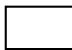
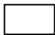
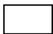
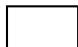
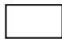
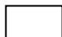
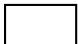
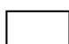

# APPLICATION FOR THE ESTABLISHMENT OF EXCHANGE AS PURSUANT TO SECTION 134 OF THE LABUAN FINANCIAL SERVICES AND SECURITIES ACT 2010

## IMPORTANT NOTES

1. The completed application form and supporting documents should be submitted to:

Head of Authorisation and Licensing Unit

Labuan Financial Services Authority

Level 17, Main Office Tower

Financial Park Complex

Jalan Merdeka

87000 Labuan F.T.

Malaysia

2. Applicant may also submit a soft copy of the completed application form and supporting documents via email to licensing@labuanfsa.gov.my for preliminary review by the officer.  
3. Submission of application which does not comply with Labuan FSA's requirement or which are unsatisfactory may be returned.  
4. The form and supporting documents serves as general requirement of the application, Labuan FSA reserves the right to request for additional information and/or documents to support the application.  
5. Any information supplied pursuant to this form will be dealt with in confidence in accordance with Section 178 of the Labuan Financial Services and Securities Act 2010/Section 139 of the Labuan Islamic Financial Services and Securities Act 2010.  
6. Documents may be certified by any authorised person including, but not limited to, commissioner for oaths, notary public, certified public accountants, advocates or solicitors, company secretaries and Malaysian/foreign embassies. Copy of bank statements must be certified by the bank. Where documents are not in the national language of Malaysia or in English, please provide English-translated version of the documents, duly certified/notarized.  
7. This document belongs to Labuan FSA, no modification or tampering with the format or its contents is permitted.  
8. Labuan FSA has a whistle blowing policy in place where suppliers, consultants or even members of the public can report to the Designated Officers in writing as per the Whistle Blowing Disclosure Form if there is any element of wrongdoings by any staff of Labuan FSA or its subsidiaries in relation to the application or licence being awarded.  
9. For details of applicable legislations and guidelines pertaining to exchange business, please visit our website at www.labuanfsa.gov.my.  
10. Processing fee and client charter:

<table><tr><td rowspan="2">Type of Processing</td><td>Processing fee</td><td rowspan="2">Client Charter*</td></tr><tr><td>USD</td></tr><tr><td>Normal</td><td>350.00</td><td>30 working days</td></tr><tr><td>Fast Track</td><td>1,550.00</td><td>15 working days</td></tr></table>

*Client Charter will be calculated upon complete submission of documentation and information to Labuan FSA.

11. Terms and Conditions of fast track application:

(i) Labuan FSA reserved the right to accept or decline any fast track application submitted.  
(ii) The fast track processing timeline will only commence upon compliance with the following:

## IMPORTANT NOTES

(a) Submission of complete documentation;  
(b) Payment of fast track processing fee; and  
(c) Acceptance of fast track application by Labuan FSA.

(iii) The fast track processing fee will be forfeited should the applicant decided to withdraw after the fast track application has been accepted by Labuan FSA.  
(iv) Labuan FSA reserved the right to change the status of the application from fast track to normal processing. The applicant will be notified and the fast track processing fee paid will be refunded accordingly.

### GENERAL INFORMATION

#### Important: All fields are mandatory and should not be left blank

1. Party responsible for submission of application1:

Applicant's Shareholder

Labuan Trust Company

Others: (please specify)

2. Officer responsible for submission of application:

Name

Company

Designation :

Contact No.:

Email

Signature :

3. How do you know about Labuan IBFC?

Website

□ Newspaper/Media

Previous Experience

Business Referral

Labuan Trust Company

Labuan IBFC Inc. Sdn. Bhd.2

Others: (please specify)

4. Consent for disclosure of information to be used for marketing/promotional purposes by Labuan FSA and Labuan IBFC Inc. Sdn. Bhd.:

Yes

# APPLICATION FOR THE ESTABLISHMENT OF EXCHANGE

Sections 134, Labuan Financial Services and Securities Act 2010

<table><tr><td colspan="5">PART I: PROFILE OF APPLICANT
Important: All fields are mandatory and should not be left blank</td></tr><tr><td>a. Name of Applicant
(refers to the proposed exchange)</td><td colspan="4"></td></tr><tr><td rowspan="2">b. Digital Related</td><td></td><td colspan="3">Yes</td></tr><tr><td></td><td colspan="3">No</td></tr><tr><td rowspan="3">c. Nature of Legal Entity
(Please tick (✓) the appropriate box)</td><td></td><td colspan="3">Labuan Company – Subsidiary</td></tr><tr><td></td><td colspan="3">Foreign Labuan Company – Branch</td></tr><tr><td></td><td colspan="3">Branch of a Malaysian Bank</td></tr><tr><td rowspan="2">d. Marketing Office to be Established
(please tick (✓) at the appropriate box)</td><td></td><td colspan="3">Yes. Proposed address:</td></tr><tr><td></td><td colspan="3">No</td></tr><tr><td>e. Proposed Paid-up Capital/Working Fund (please specify currency used)</td><td colspan="4"></td></tr><tr><td rowspan="2">f. Proposed Shareholder(s)</td><td colspan="2">Name of
Shareholder(s)</td><td>Country of
Origin</td><td>Percentage of
Shareholding(s)</td></tr><tr><td colspan="2"></td><td></td><td></td></tr><tr><td rowspan="2">g. Proposed Directors / Principal Officer
(each of director/ principal officer is required to complete Part III)</td><td colspan="2">Name of
Director(s)/Principal Officer</td><td>Nationality</td><td>Position to be Held</td></tr><tr><td colspan="2"></td><td></td><td></td></tr><tr><td rowspan="2">h. Proposed exchange committee
(please submit the profiles of the chairman and two (2) committee members)</td><td colspan="2">Name of
Committee</td><td>Nationality</td><td>Position to be Held</td></tr><tr><td colspan="2"></td><td></td><td></td></tr><tr><td rowspan="2">i. Proposed Shariah Advisor(s)
(each of Shariah Advisor is required to complete Part III</td><td colspan="2">Name of
Advisor(s)</td><td>Nationality</td><td>Years of Experience in Islamic Financial Business</td></tr><tr><td colspan="2"></td><td></td><td></td></tr><tr><td colspan="5">PART II: PROFILE OF CORPORATE SHAREHOLDER
Important: All fields are mandatory and should not be left blank</td></tr><tr><td>a. Name of Company</td><td colspan="4"></td></tr><tr><td>b. Company Address</td><td colspan="4"></td></tr><tr><td>c. Nature and Type of Business</td><td colspan="4"></td></tr><tr><td>d. Incorporation/Registration Number</td><td colspan="4"></td></tr><tr><td>e. Date and Place of Incorporation/Registration</td><td colspan="4"></td></tr><tr><td>f. Date, Type of Licence and Licence Number</td><td colspan="4"></td></tr><tr><td>g. Home Supervisory Authority</td><td colspan="4"></td></tr><tr><td rowspan="4">Shareholders' Fund (please specify currency and amount for the latest three (3) years of Audited Financial Statement)</td><td>Year</td><td>Paid-up Capital</td><td>Retained Profits/Accumulated losses</td><td>Other Reserve</td></tr><tr><td></td><td></td><td></td><td colspan="1"></td></tr><tr><td></td><td></td><td></td><td colspan="1"></td></tr><tr><td></td><td></td><td></td><td colspan="1"></td></tr><tr><td rowspan="4">Financial Performance (please specify currency and amount for the latest three (3) years of Audited Financial Statements)</td><td>Year</td><td>Total Assets</td><td>Total Liabilities</td><td>Profit/(Loss) Before Tax</td></tr><tr><td></td><td></td><td></td><td colspan="1"></td></tr><tr><td></td><td></td><td></td><td colspan="1"></td></tr><tr><td></td><td></td><td></td><td colspan="1"></td></tr><tr><td rowspan="2">j. Shareholder(s)</td><td colspan="2">Name of Shareholder(s)</td><td>Country of Origin</td><td>Percentage of Shareholding (s)</td></tr><tr><td colspan="2"></td><td></td><td colspan="1"></td></tr><tr><td rowspan="2">k. Board of Director(s)</td><td colspan="2">Name of Director(s)</td><td>Nationality</td><td>Nature of Appointment (executive or non-executive)</td></tr><tr><td colspan="2"></td><td></td><td colspan="1"></td></tr><tr><td>l. Any Other Information Relevant For Consideration of the Application</td><td colspan="4"></td></tr></table>

<table><tr><td colspan="4">PART III: PROFILE OF DIRECTOR(S) / PRINCIPAL OFFICER/EXCHANGE COMMITTEE
Important: All fields are mandatory and should not be left blank</td></tr><tr><td>a. Position to be held</td><td colspan="3"></td></tr><tr><td>b. Salutation</td><td colspan="3"></td></tr><tr><td>c. Name 
(as per NRIC/passport)</td><td colspan="3">Please tick (✓) if the individual is a Politically Exposed Person (PEP)</td></tr><tr><td>d. Date and Place of Birth</td><td colspan="3"></td></tr><tr><td>e. Gender</td><td colspan="3">Male     Female</td></tr><tr><td>f. Nationality</td><td colspan="3"></td></tr><tr><td>g. NRIC Details 
(for Malaysian)</td><td colspan="3">Old IC No.: 
NRIC No.:</td></tr><tr><td>h. Passport Details 
(for Non-Malaysian)</td><td colspan="3">Passport No.: 
Expiry Date: 
Country of Issue: 
Issuing Authority: 
Length of residence in Malaysia: 
Any work permit applied prior to this application: 
□  No   □  Yes 
(please provide certified true copy of the work permit)</td></tr><tr><td colspan="4">i. Curriculum Vitae of Director/Principal Officer/Shariah Advisor</td></tr><tr><td colspan="4">Section A: Education(s)</td></tr><tr><td colspan="2">Type of Qualification/ Certification</td><td>Name of College/University/Others</td><td>Year Qualification Obtained</td></tr><tr><td colspan="2"></td><td></td><td></td></tr><tr><td colspan="4">Section B: Professional Qualification(s)</td></tr><tr><td colspan="2">Type of Qualification/ Certification</td><td>Name of Institution</td><td>Year Qualification Obtained</td></tr></table>

<table><tr><td colspan="7">PART III: PROFILE OF DIRECTOR(S) / PRINCIPAL OFFICER/EXCHANGE COMMITTEE
Important: All fields are mandatory and should not be left blank</td></tr><tr><td colspan="2"></td><td colspan="4"></td><td></td></tr><tr><td colspan="7">Section C: Membership of Professional Body(s)</td></tr><tr><td colspan="2">Type and Details of Membership</td><td colspan="4">Name of Institution</td><td>Year Membership Obtained</td></tr><tr><td colspan="2"></td><td colspan="4"></td><td></td></tr><tr><td colspan="7">Section D: Past and Current Work Experience(s)</td></tr><tr><td colspan="2">Date
(dd/mm/yy)</td><td rowspan="2">Name of Employer3</td><td rowspan="2" colspan="2">Designation</td><td rowspan="2" colspan="2">Key Areas of Responsibilities</td></tr><tr><td>From</td><td>To</td></tr><tr><td></td><td></td><td></td><td colspan="2"></td><td colspan="2"></td></tr><tr><td colspan="7">Section E: Directorship Held in Other Company(s)</td></tr><tr><td colspan="2">Name of Corporation</td><td>Place of Incorporation</td><td colspan="2">Date of Appointment
(dd/mm/yy)</td><td colspan="2">Nature of Appointment
executive or non-executive)</td></tr><tr><td colspan="2"></td><td></td><td colspan="2"></td><td colspan="2"></td></tr></table>

<table><tr><td colspan="3">PART VI: PARTICULARS OF THE APPLICATION
Important: All fields are mandatory and should not be left blank</td></tr><tr><td colspan="3">Section A: Business Plan (Please fill in the details, where applicable)</td></tr><tr><td>a. Objective of Establishment</td><td colspan="2"></td></tr><tr><td>b. Type of Products/Services</td><td colspan="2"></td></tr><tr><td rowspan="4">Target Market
  (to specify whether it is individual and/or corporate client and the percentage)</td><td colspan="2"></td></tr><tr><td>Target Market</td><td>%</td></tr><tr><td>Individual</td><td></td></tr><tr><td>Corporate Client</td><td></td></tr><tr><td rowspan="4">d. Target Industry/Sector
  (to specify the industry/sector and the percentage)</td><td colspan="2"></td></tr><tr><td>Territorial Scope</td><td>%</td></tr><tr><td></td><td></td></tr><tr><td></td><td></td></tr><tr><td>e. Territorial Scope
  (to specify the country and percentage)</td><td colspan="2"></td></tr><tr><td colspan="3">f. Business Operational and Strategic Plan
  (included but not limited to the following) – to be presented in a schematic diagram</td></tr><tr><td>• Business Operating Model (Briefly describe the business structure for exchange business)</td><td colspan="2"></td></tr><tr><td>• Profile of Listing sponsor</td><td colspan="2"></td></tr><tr><td>• Profile of Trading agent</td><td colspan="2"></td></tr><tr><td>• Profile Custodian</td><td colspan="2"></td></tr><tr><td>g. Trading Platform &amp; Technology system
(Please the describe of trading platform and technology system to be used for the exchange business)</td><td colspan="2"></td></tr><tr><td>h. Marketing Strategy</td><td colspan="2"></td></tr></table>

PART VI :PARTICULARS OF THE APPLICATION  
Important: All fields are mandatory and should not be left blank  

<table><tr><td rowspan="6">i. Manpower Planning</td><td>Category</td><td>Malaysian</td><td>Non-Malaysian</td><td>Total</td><td>Expected Remuneration</td></tr><tr><td>(a) Managerial &amp; Professional</td><td></td><td></td><td></td><td></td></tr><tr><td>(b) Technical &amp; Supervisory</td><td></td><td></td><td></td><td></td></tr><tr><td>(c) Production / Operation Workers - Skilled - Unskilled</td><td></td><td></td><td></td><td></td></tr><tr><td>(d) Clerical &amp; General Workers</td><td></td><td></td><td></td><td></td></tr><tr><td>Total (a)+(b)+(c)+(d)</td><td></td><td></td><td></td><td></td></tr><tr><td colspan="6">Note: Please provide for 3 years breakdown for manpower</td></tr><tr><td>j. Functional Structure of Management Office in Labuan</td><td colspan="5"></td></tr><tr><td>k. Functional Structure of Marketing Office (if any)</td><td colspan="5"></td></tr></table>

<table><tr><td colspan="4">Section B: Three Years Financial Projection (*fill in where applicable)</td></tr><tr><td colspan="4">PART VI:PARTICULARS OF THE APPLICATION
Important:All fields are mandatory and should not be left blank</td></tr><tr><td>Total number of listings</td><td></td><td></td><td></td></tr><tr><td>Total number of trading volume</td><td></td><td></td><td></td></tr><tr><td rowspan="2">Statement of Comprehensive Income</td><td>Year 1</td><td>Year 2</td><td>Year 3</td></tr><tr><td colspan="3">Currency:</td></tr><tr><td>Revenue</td><td></td><td></td><td></td></tr><tr><td>Operating Expenses</td><td></td><td></td><td></td></tr><tr><td>Operating Profit/(Loss)</td><td></td><td></td><td></td></tr><tr><td>Other Income</td><td></td><td></td><td></td></tr><tr><td>General and Administrative Expenses</td><td></td><td></td><td></td></tr><tr><td>Income/(Loss) Before Tax</td><td></td><td></td><td></td></tr><tr><td>Tax</td><td></td><td></td><td></td></tr><tr><td>Income/(Loss) After Tax</td><td></td><td></td><td></td></tr><tr><td>Statement of Financial Position</td><td>Year 1</td><td>Year 2</td><td>Year 3</td></tr><tr><td colspan="4">ASSETS</td></tr><tr><td>Non-current assets</td><td></td><td></td><td></td></tr><tr><td>Current assets</td><td></td><td></td><td></td></tr><tr><td>Total Assets</td><td></td><td></td><td></td></tr><tr><td colspan="4">LIABILITIES</td></tr><tr><td>Long term liabilities</td><td></td><td></td><td></td></tr><tr><td>Short term liabilities</td><td></td><td></td><td></td></tr><tr><td>Total Liabilities</td><td></td><td></td><td></td></tr><tr><td colspan="4">SHAREHOLDERS’ FUNDSP/HEAD OFFICE ACCOUNT</td></tr><tr><td>Paid up capital</td><td></td><td></td><td></td></tr><tr><td>Retained profits / accumulated losses</td><td></td><td></td><td></td></tr><tr><td>Other reserves</td><td></td><td></td><td></td></tr><tr><td>Total Shareholders’ Funds/Head Office Account</td><td></td><td></td><td></td></tr><tr><td colspan="4">Note:
1. Please ensure the three years projection is realistic and reasonable.
2. Please provide basis of assumption in deriving to the projected figure.
3. The above information is a guidance for the applicant to complete the financial projection.</td></tr><tr><td colspan="4">PART IV: SUPPORTING DOCUMENTS
(Pleases at the appropriate box and provide reason(s)/justification(s) for any non-submission)</td></tr><tr><td colspan="4">Supporting Documents
(Pleases at the appropriate box and provide reason(s)/justification(s) for any non-submission)</td></tr><tr><td>No</td><td>Documents</td><td>To be completed by Applicant</td><td>For Labuan FSA use</td></tr><tr><td colspan="4">Part II: Corporate Shareholder(s)</td></tr><tr><td rowspan="6">1.</td><td>Detailed information of applicant's shareholder:
a) Group corporate shareholding structure</td><td></td><td></td></tr><tr><td>b) Certified true copy of certificate of incorporation</td><td></td><td colspan="1"></td></tr><tr><td>c) Certified true copy of certificate of licence granted by relevant authority(s) in its home country - (if applicable)</td><td></td><td colspan="1"></td></tr><tr><td>d) Certified true copy of board resolution or minutes of general meeting which approved the setting up of the applicant</td><td></td><td colspan="1"></td></tr><tr><td>e) Certified true copy of memorandum &amp; articles of association</td><td></td><td colspan="1"></td></tr><tr><td>f) Copy of two (2) years audited financial statements/annual reports</td><td></td><td colspan="1"></td></tr><tr><td>2.</td><td>Letter of guarantee from the Applicant's shareholder</td><td></td><td></td></tr><tr><td colspan="4">Part III: Proposed Director(s)/ Principal Officer/ Exchange/ Committee</td></tr><tr><td>1</td><td>Certified true copy of NRIC (Malaysian) or passport (non-Malaysian)</td><td></td><td></td></tr><tr><td>2</td><td>Certified true copy of relevant academic and professional certificates</td><td></td><td></td></tr><tr><td>3</td><td>Two (2) referral letters from institutions and/or professional bodies (not applicable for appointment within the group of companies)</td><td></td><td></td></tr><tr><td>4</td><td>Statutory Declaration by Director/Committee on Fit and Proper Person as per Appendix II.</td><td></td><td></td></tr><tr><td>5.</td><td>Enhance Due Diligence report from the trust company / service provider, if applicable.</td><td></td><td></td></tr><tr><td colspan="4">Other Supporting Documents</td></tr><tr><td>1.</td><td>Proposed organisation chart of the applicant</td><td></td><td></td></tr><tr><td>2.</td><td>Comprehensive business plan of exchange business including White paper</td><td></td><td></td></tr><tr><td>3.</td><td>Declaration of True and Correct Information Submitted as per Appendix III.</td><td></td><td></td></tr><tr><td>4.</td><td>Statutory Declaration by Services Provider Responsible for Submission of Application as per Appendix IV.</td><td></td><td></td></tr><tr><td>5.</td><td>Framework on Know-Your-Customers' policy and compliance to the Anti-Money Laundering, Anti-Terrorism Financing and Proceeds of Unlawful Activities Act 2001</td><td></td><td></td></tr><tr><td>6.</td><td>Risk Management and Internal Control Policy, if any. The policy must be available for inspection once the licence is granted.</td><td></td><td></td></tr><tr><td>7.</td><td>Draft copies of its own set of By-laws, Rules of Exchange and Regulatory Functions. The final policies must be made available for inspection once the licence is granted.</td><td></td><td></td></tr></table>

## Name and Address of Corporate Shareholder

[Date]

The Director General

Labuan Financial Services Authority

Level 17, Main Office Tower

Financial Park Labuan, Jalan Merdeka

87000 Federal Territory of Labuan

Malaysia

Dear Sir,

## LETTER OF GUARANTEE

The application by [name of applicant], a subsidiary of [name of shareholder], to Labuan FSA dated [date] for a license to carry on Labuan [type of licence] business under the provisions of the Labuan Financial Services and Securities Act 2010/Labuan Islamic Financial Services and Securities Act 2010 [delete whichever not applicable] (hereinafter referred to as "the Act") refers.

We, being the shareholder, do hereby irrevocably and unconditionally guarantee and undertake in respect of [name of applicant]'s Labuan [type of licence] business that during validity of [name of applicant]'s licence and its operation in Labuan IBFC, it shall comply with the following:

a. The financial obligations and requirements imposed under the Act on it and shall meet its liabilities in respect of its Labuan [type of licence] business.  
b. The requirement to obtain a prior written approval from Labuan FSA for:

i. any change of [name of applicant]'s shareholder who holds ten per cent or more of its paid-up capital.  
ii. any appointment of [name of applicant]'s director and principal officer, whom shall be of a fit and proper person.  
iii. any amendment or alteration to any of [name of applicant]'s constituent documents.

c. The requirement to immediately notify Labuan FSA of any amendment or alteration to any information which had been furnished to Labuan FSA in connection with the application for the Labuan [type of licence] business.

We shall when so demanded in writing by Labuan FSA, on first demand, make good, meet and honour the above requirements including, but not limited to, paying such sum of money in satisfaction of such financial obligations, requirements and liabilities to the extent they are properly due in such currency as may be specified by Labuan FSA, and on the basis such payments extinguish such financial obligations, requirements and liabilities of [name of applicant] and the Company.

Yours faithfully,

For and on behalf of

[Name of shareholder]

[Name]

Director

## PART IV: STATUTORY DECLARATION BY DIRECTOR/PRINCIPAL OFFICER ON FIT AND PROPER PERSON

Important: All fields are mandatory and should not be left blank

I, . . . . . . . . . . . . . . . . . . . . . . . . . . . . . . . . . . . . . . . . . . . . . . . . . . . . . . . . . . . . . . . . . . . . . . . . . . . . . . . . . . ..
 director/principal officer of. (name of the Labuan company), do hereby solemnly and sincerely declare that:

1. I have read Section 4 of the Labuan Financial Services and Securities Act 2010 (LFSSA) /Section 4 of the Labuan Islamic Financial Services and Securities Act 2010 (LIFSSA) and the Guidelines on Fit and Proper Person Requirements issued on 11 February 2014 (the Guidelines).  
2. to the best of my knowledge and belief in making this declaration and/or submitting the attached documents in relation to this declaration, that I am a fit and proper person based on the criteria stated under the said Section 4 of LFSSA /Section 4 of LIFSSA and the Guidelines.  
3. the information given in this declaration and in the attached documents (if any) are accurate, true and complete.  
4. I understand that if it is found that I have made false declaration herein and/or in the attached document (if any), Labuan FSA is entitled to take any legal action including disqualifying myself from acting in the capacity expressly mentioned herein.

And I make this solemn declaration conscientiously believing the same to be true and by virtue of the provisions of the Statutory Declaration Act 1960/ ....(please state any other relevant provisions).

Subscribed and solemnly declared by the above named

At

In the State of

This ...day of .... 20..

Signature

Before me,

(Commissioner for Oaths/Notary Public)

# PART VI: DECLARATION OF TRUE AND CORRECT INFORMATION SUBMITTED Important: All fields are mandatory and should not be left blank

I .NRIC/Passport No:

the (position in the applicant's shareholder/head office)

of....(name of the applicant's

shareholder/head office), do hereby solemnly and sincerely declare that:

1. all information submitted in this application including all attachments, forms, documents and forwarding letters are accurate, true and correct and that all estimations provided are fair and reasonable.  
2. I am aware that if I make any misrepresentation herein this application, it is an offence punishable pursuant to Section 192 of the LFSSA.  
3. a printed signed copy of this application which reflects the same information provided in this application is being kept at the office of my principal or our appointed Labuan trust company being the agent approved by Labuan FSA.

And I make this solemn declaration conscientiously believing the same to be true and by virtue of the provisions of the Statutory Declaration Act 1960 / .(please state any other relevant provisions).

Subscribed and solemnly declared by the above

named

At

In the State of

This ...day of 20...

Before me,

(Commissioner for Oaths/Notary Public)

Signature

## STATUTORY DECLARATION BY SERVICE PROVIDER RESPONSIBLE FOR SUBMISSION OF APPLICATION

Important: All fields are mandatory and should not be left blank

I, _________(name) of _________(address)NRIC/Passport No: _________ the authorized officer of _________(name of trust company/other service providers) being the party responsible for the submission of application for _________(name of applicant) do solemnly and sincerely declare that in relation to the above application:

1. I have conducted due diligence process on............ (name of applicant) and on its director(s) and shareholder(s) and other persons or companies that involved and related to the application and satisfied with the result thereof.  
2. I am satisfied that the requirements of all legislations and applicable guidelines including but not limited to Guidelines on Fit and Proper Person and Anti-Money Laundering and Anti-Money Laundering, Anti-Terrorism Financing and Proceeds of Unlawful Activities Act 2001 in respect of the above application have been complied with.

And I make this solemn declaration conscientiously believing the same to be true, and by virtue of the provisions of the Statutory Declaration Act 1990/ (please state any other relevant provisions).

Subscribed and solemnly declared by the above named

At

In the State of

This ...day of .... 20..

Signature

Before me,

(Commissioner for Oaths/Notary Public)